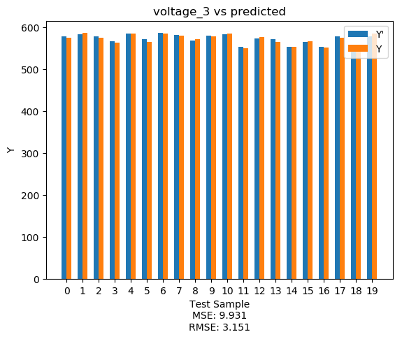

# CSI5130 Homework 1 Question 3 Report - Adrian Sandoval-Vargas

### Impacts of Hyperparameters

Hyperparameters have a significant impact on the linear model. Changes in the learning rate, iterations, and the initial weights will ultimately affect the way any linear model calculates its weights.
For example, 


>Figure 1: Cost Function of response variable. Data was stardardize.

Our parameters are: learning rate = 0.01, iterations = 750, and weights are randomly chosen. As we can see our cost decreases until it plateaus around 100-300 iterations.

If we decrease the learning rate to 0.0001, what will happen?


>Figure 2: Cost Function of response variable. Data was stardardize. iterations = 750.

It is a bit intuitive. As we decrease the value of the learning rate the more iterations is needed to find the plateau. Let's increase the iterations to 2000.


>Figure 3: Cost Function of response variable. Data was stardardize. Learning Rate = 0.0001.

From these observations we can ask our selves isn't learning fast better? Not necessarily, we want the goldilock zone between the learning rate and the weights associated to it. Learn to fast and the weights will drastically changes and possibly not converge. Learn to slow and the linear model will require more memory to compute and it might not reach the minima.

Learning depends on the type of data. Whether the data is structed or unstructured will have an impact on the model. Another big factor is the type of algorithm you use to calculate your weights.

### Ordinary Least Squares (OLS)

Using OLS for a linear model results in a good model. Here are 7 graphs of the response variables using this technique.





>Figure 4: Voltage Output using OLS. 20 Samples were chosen for depiction.


>Figure 5: NaOH Output using OLS. 20 Samples were chosen for depiction.

### Gradient Descent and Stochastic Gradient Descent

These two algorithms are similar in nature. They both use a cost function, learning rate, initialized weights, input attributes, input labels, and the times you want to run the algorithm. They both predict the wieghts through an iterative approach. It is during this step that they are slightly different.

#### The Difference

Gradient Descent does the calcualtions through all the points in the dataset every iteration. This means that if you have 1 million data points this algorithm will do the computations 1 million * how many iterations you specify.

Stochastic Gradient Descent takes a stab at randomness. During the iterations SGD randomly selects a point in the dataset and does the computations. One may ask, what happens to the selected value on the next iteration? Well, SGD puts back the value back into the dataset to keep it the randomness the same through out the iterations. This means that you can theoretically obtain duplicated values, but SGD is much more efficient than GD. For example,

```python
#Hyperparameters:
alpha = 0.0001 #step
iterations = 5000 # iterations
np.random.seed(123) #sets random seed
w = np.random.rand(attributes.shape[1]+1) #random variables for the weights

#Normalize Data
n_attributes = (attributes - mean(attributes)) /stdev(attributes)
n_attributes = np.c_[np.ones(attributes.shape[0]), n_attributes]
y_norm = (naoh_out - mean(naoh_out)) / stdev(naoh_out)
sgd_n_attributes = (attributes - mean(attributes)) / stdev( attributes)
#gradient descent
start = timeit.default_timer()
weights, cost = gd(n_attributes, y_norm, w,alpha, iterations)
time = timeit.default_timer() - start
print(time)

w = np.delete(w, 0,0) # removes bias of GD weight
#Stochastic Gradient Descent
start = timeit.default_timer()
w_ = sgd(sgd_n_attributes.to_numpy(), y_norm, w, alpha, iterations)
time = timeit.default_timer() - start
print(time)

```

GD Execution is: ~9.129556194 seconds

SGD Execution is: ~0.1605141799 seconds

This makes SGD a better option when it comes to performance because of it likely hood to converge in significantly less time.
